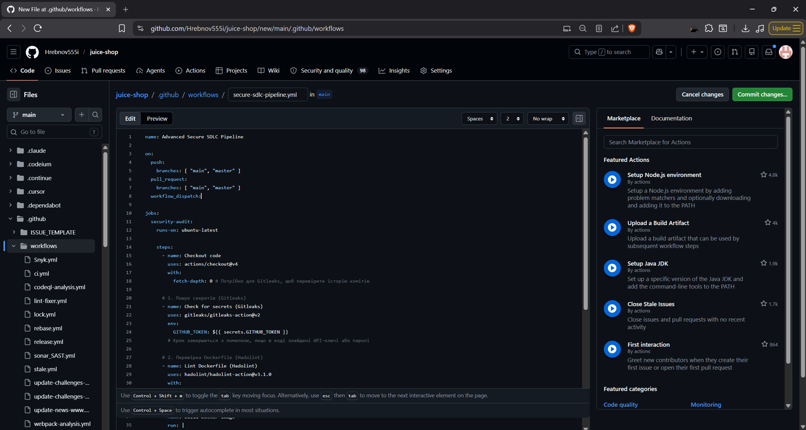
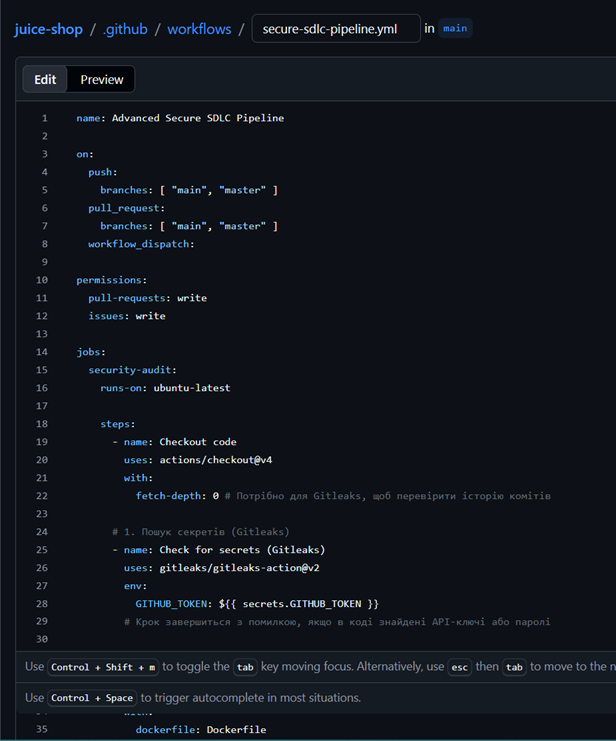
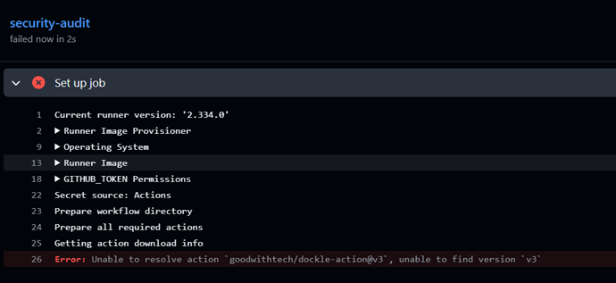
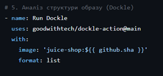
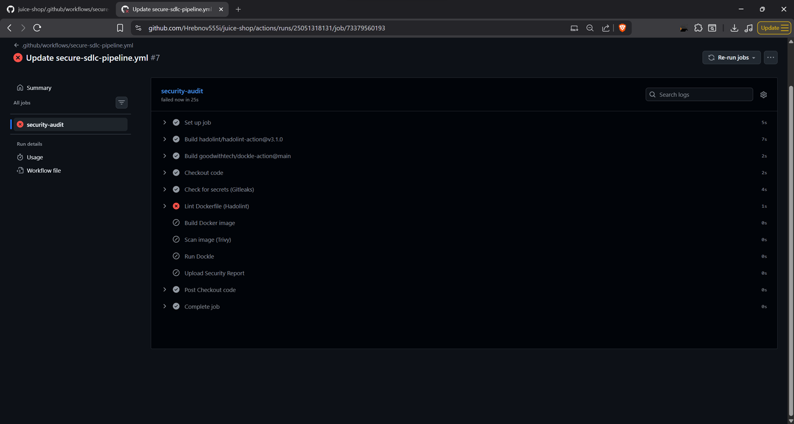
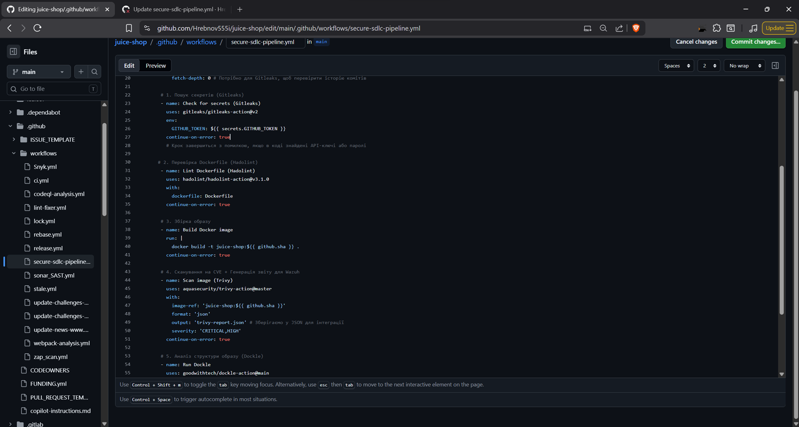
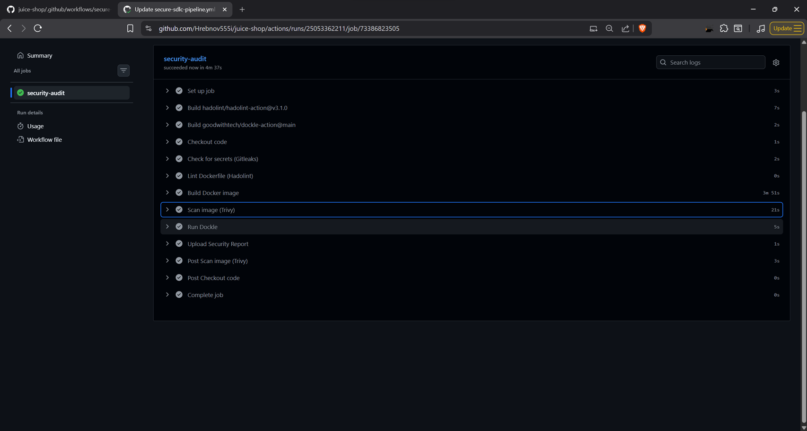
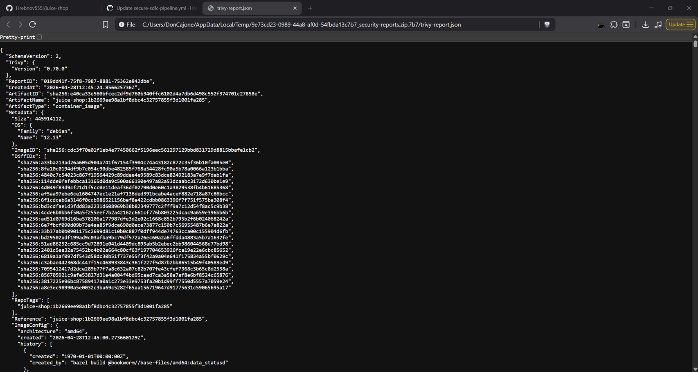

# Звіт: Налаштування Secure SDLC Pipeline

## 1. Створення secure-sdlc-pipeline.yml
Створено файл конфігурації для автоматизації перевірок безпеки.
**Коротко про код:** Пайплайн запускається автоматично при push або pull_request. Він послідовно перевіряє правильність написання Dockerfile (Hadolint), збирає Docker-образ, сканує його на вразливості (Trivy), аналізує структуру образу (Dockle) та зберігає JSON-звіт як артефакт.



## 2. Додавання прав доступу
Для коректної роботи екшенів з репозиторієм додано блок `permissions`:
```yaml
permissions:
  pull-requests: write
  issues: write
```



## 3. Проблема з Dockle v3
Під час запуску виникла помилка, оскільки 3-тя версія екшена не спрацювала коректно.



## 4. Виправлення версії Dockle
У коді пайплайну версію було змінено на `dockle-actions@main`.



## 5. Результат виконання Action
Відображення статусу виконання пайплайну після оновлення версії Dockle.



## 6. Впровадження continue-on-error
До кожного кроку було додано параметр `continue-on-error: true`, щоб пайплайн продовжував роботу і генерував звіти навіть при знаходженні вразливостей.



## 7. Репорт екшена
Фінальний звіт про виконання всіх етапів пайплайну в GitHub Actions.



## 8. Завантаження звіту
З артефактів було завантажено згенерований файл `trivy-report.json`.




---

## Знайдені вразливості

### Critical Vulnerabilities

**CVE-2026-31789 (libssl3)**
* **Description:** A heap buffer overflow occurring on 32-bit systems when converting excessively large OCTET STRING values to hexadecimal strings during X.509 certificate processing.
* **Impact:** This could lead to a crash or potentially attacker-controlled code execution.
* **Installed Version:** 3.0.18-1~deb12u2
* **Fixed Version:** 3.0.19-1~deb12u2

### High Vulnerabilities

**Multiple OpenSSL Vulnerabilities (libssl3)**
* **CVE-2026-28387:** An arbitrary code execution risk due to a use-after-free error in clients performing DANE TLSA-based server authentication.
* **CVE-2026-28388:** A Denial of Service (DoS) vulnerability caused by a NULL pointer dereference when processing a malformed delta CRL.
* **CVE-2026-28389 & CVE-2026-28390:** DoS vulnerabilities stemming from NULL pointer dereferences during the processing of crafted CMS EnvelopedData messages.

**CVE-2026-0861 (libc6)**
* **Description:** An integer overflow in the memalign suite of functions in the GNU C Library that could lead to heap corruption.
* **Impact:** While exploitation requires the attacker to control both the size and alignment arguments, it carries a high CVSS 3.1 score of 8.1.
* **Installed Version:** 2.36-9+deb12u13
